最近在办公室杂物里翻出了一台网协曾经使用过的服务器，型号为 IBM System x3550，机身上标记的时间是 2008 年。在群里讨论一波得知，此机器在 2018 年是能开机的，并且当时其中的数据已经做好了备份。

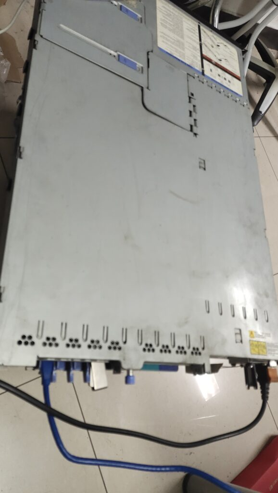

这引发了我很大的好奇心，找来电源线和各种连接线准备开机考古。接好电源后，按下开关，风扇顿时开始轰鸣起来，显示器上也出现了 BIOS 启动画面，点亮成功！

在漫长的等待后，服务器终于进入了系统，这是一个 Ubuntu 10.04 系统，多么有年代感的版本啊。可惜的是系统的密码并不知道，所以没办法登录进去了。

不过既然数据已经做好了备份，那么重装一下系统不就能进去了，想到这里，掏出启动盘准备启动。然而可能是机器过于老旧，我用 ventoy 尝试启动了 debian live 和 archlinux live iso，但是都卡住了，似乎无法进入。既然 linux 启动不了，于是又尝试启动了 Windows，这次终于有了反应，进入 Windows ISO 的启动条成功显示出来了！

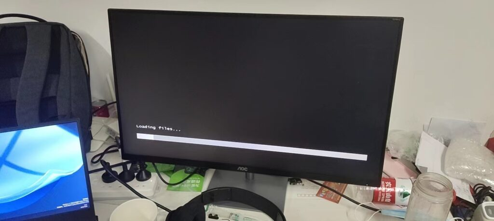

然而，接下来是漫长的等待，半个小时后，镜像才终于加载了进去，进入了安装界面。这里我怀疑是在 ventoy 下没有对应的 USB 驱动，导致 USB 只能工作在 1.0 模式下，速度极慢。

接下来就是正常的安装过程，可能和 WinPE 下驱动正常工作有关，安装过程并不是很慢，镜像读取速度终于是正常的了。

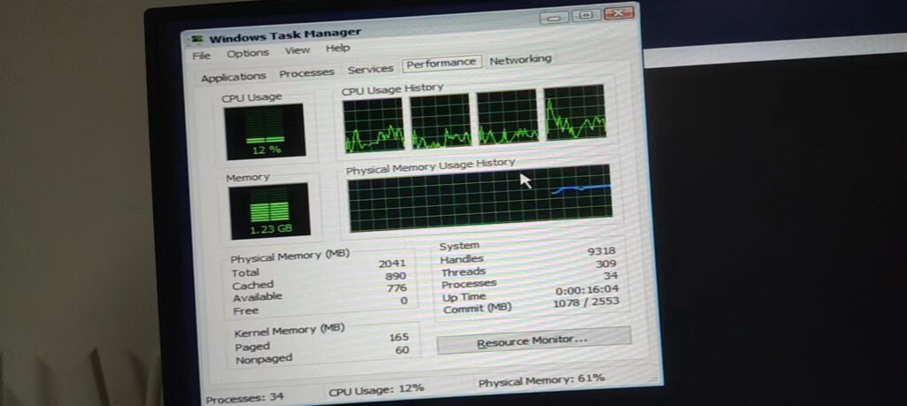

进入系统后，看看各种硬件信息，直接上图。

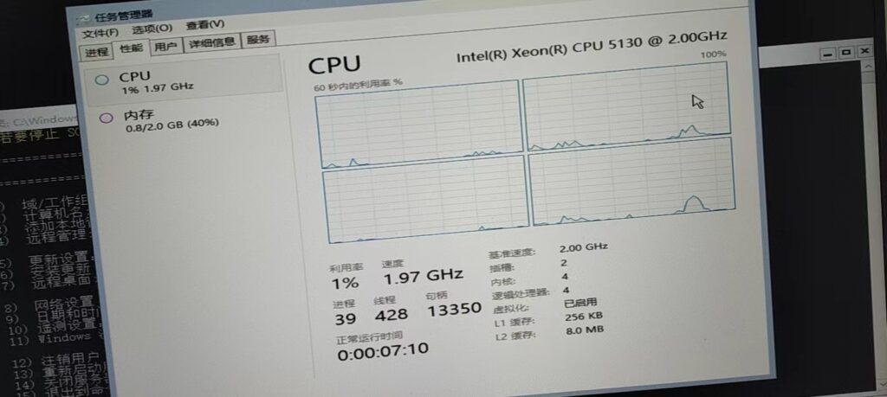

CPU 是双路至强 5130，发布于 2006 年，制程 65nm，2Ghz 主频，双核，应该是初代 Core 架构的 CPU。

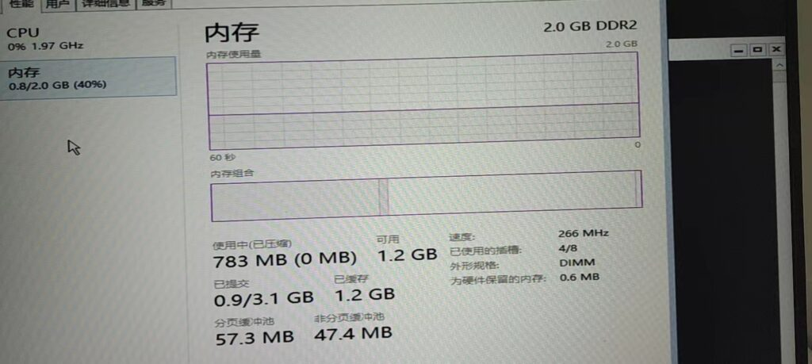

内存是 2GB DDR2，这个信息在开机自检时就已经看到了，让我意想不到的是这 2GB 内存竟然是由 4 条 512MB 的内存组成的。习惯了现在单条 8GB、16GB 甚至 32GB 的内存，看到这 512MB 的内存实在是有些意外。

然而在 Windows 下网卡并没有自动驱动起来，而我也不知道网卡型号是什么，那么去 linux 下试试呢？

这时我意识到之前我在启动 linux 时，看到系统没有响应便中止了启动，结合 WinPE 加载了那么久，是不是说 linux 也是可以启动的，只是特别缓慢呢。

插上启动盘，设置好 U 盘启动，选择 Arch 的镜像，启动。过了好一会，屏幕有了反应！果然，linux 也可以启动，只是太慢了而已，给我系统卡死的错觉。

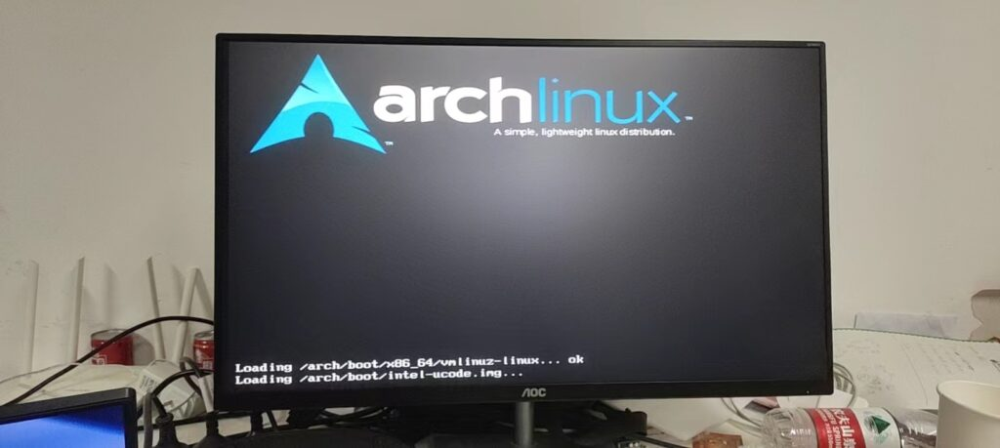

进入系统，在 iso 下输入 ip addr，果然，在 linux 网卡已经可以使用了，lspci 可以找到网卡是博通的 BCM5708。好的，至此既然有了网络，那么装个 arch 好了。

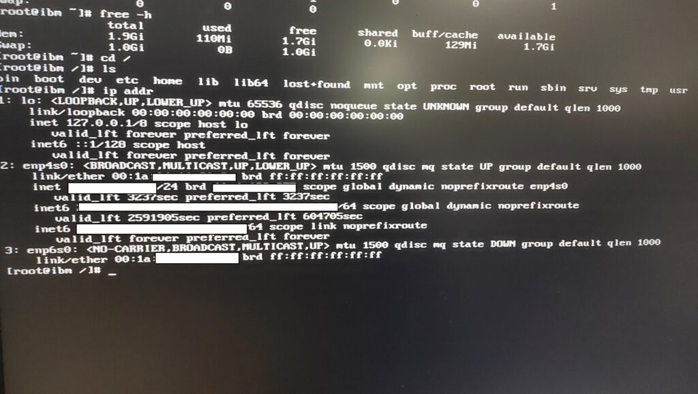

正常的安装之后，进入系统。

2GB 内存，在 linux 下开机只使用了 110MB，而 Windows Server 即使没有安装图形界面也占用了 700 多 MB 的内存空间。

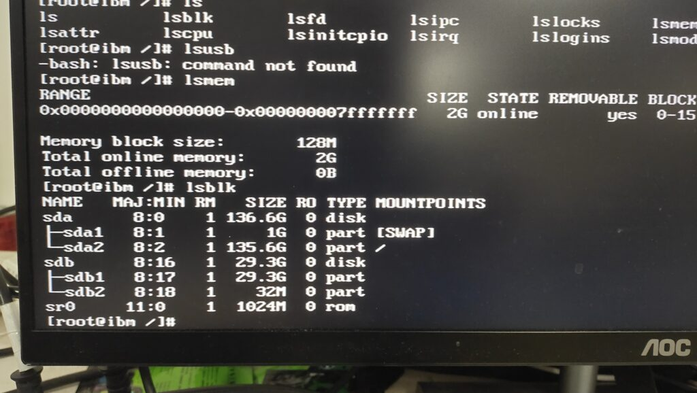

136GB 的 1.5w 转机械硬盘，测个速度吧。

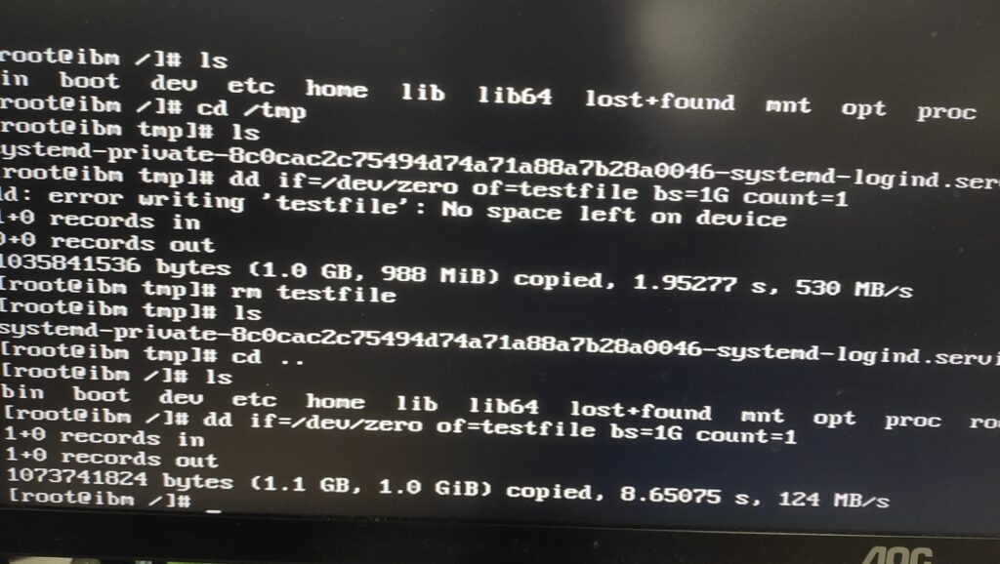

使用 dd 命令写入 1GB 的文件，在 tmpfs 中速度 530MB/s，而在万转机械盘上的根分区下是 124MB/s。虽然已经过去了快 20 年，当年的服务器万转机械盘的连续读写表现与现在家用机械硬盘来比较，速度也是不慢的。而这 DDR2 的内存速度可就不太行了，也就堪堪达到 SATA SSD 的速度。

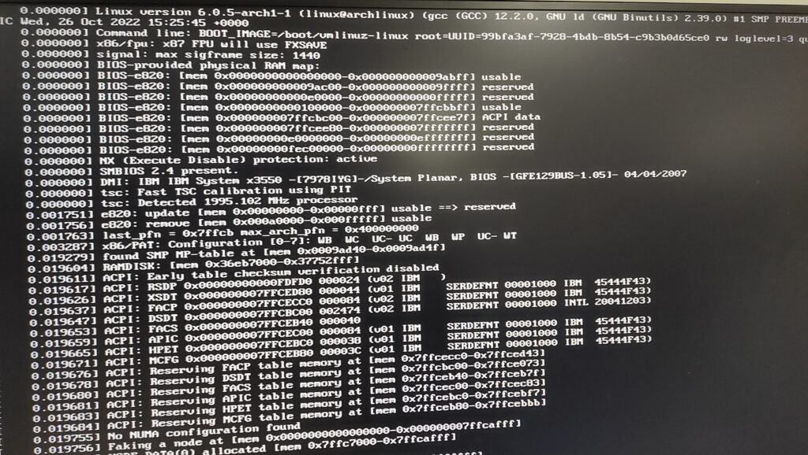

archlinux 的 dmesg 信息，最新的 6.0 内核跑着一个 15 年前的设备上。

lscpu

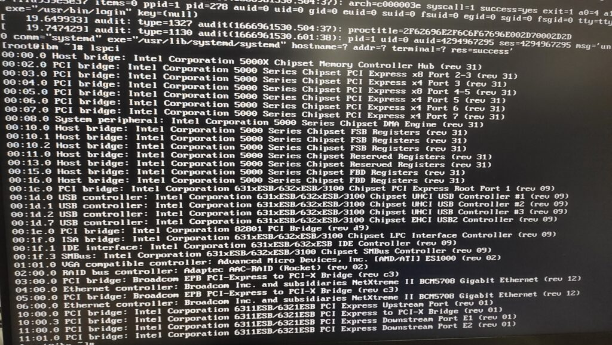

lscpi。其中注意到这个服务器的显卡是 ATI 的 ES1000，这个卡在 IBM 服务器经常见到。

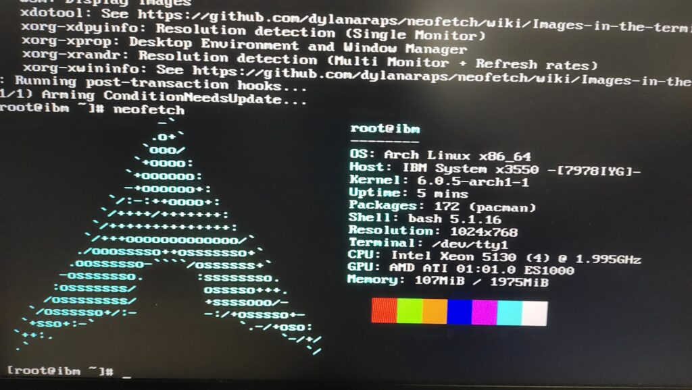

最后跑个 neofetch，完结撒花。